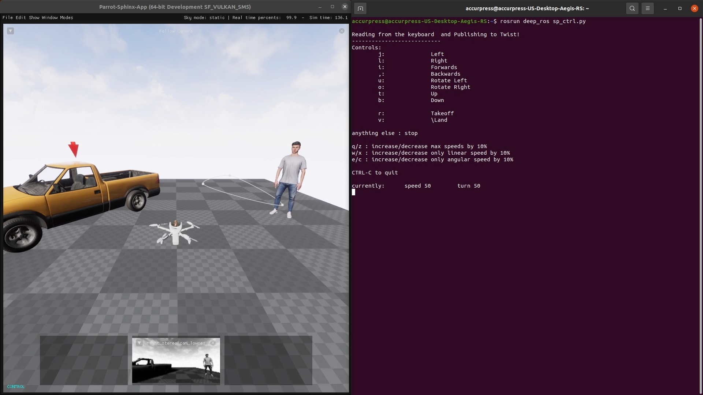

# deep_drone

This package is an extensive tutorial to learn Robotics, Deep Learning and Reinforcement Learning at the same time. Our main focus is to deploy Deep algorithms on a Parrot Anafi drone on its official simulation environemnt, Parrot Sphinx, whihc is based on Unreal Engine 4. 

<!--  -->

## Table of Contents

- [Installation](#installation)
- [Sphinx](#sphinx)
- [Flight Controller](#flight-controller)
- [Deep Flights](#deep-flights)

## Installation

For installation, follow the [README](src/Ep1_Installations/README.md) file in first episode.

## Sphinx

We use official [Parrot Sphinx](https://developer.parrot.com/docs/sphinx/index.html) simulator which is based on Unreal Engine 4. The simulator emualtes the same behaviour of the real Anafi drones allowing us to test our algorithms and controllers before implementing them on an actual drone.

## Flight Controller

Fusing Sphinx and Robot Operating System allows us to design and test our flight controllers in a simulated environment. Unlike MATLAB and other simulation environments, ROS allows you to utilize Python or C++ for your embedded design rather than a proprietary programming language.

## Deep Flights

Deep Learning plays a key-role in modern autonomous systems enabling them to perform object detection, pose estimation and target tracking. A sensible application for such algorithms is wilfire detection and monitoring which is currenlty undrtaken with drone in Canada.

## Docker Guides

## ROS 2 Instrucitons

TODO